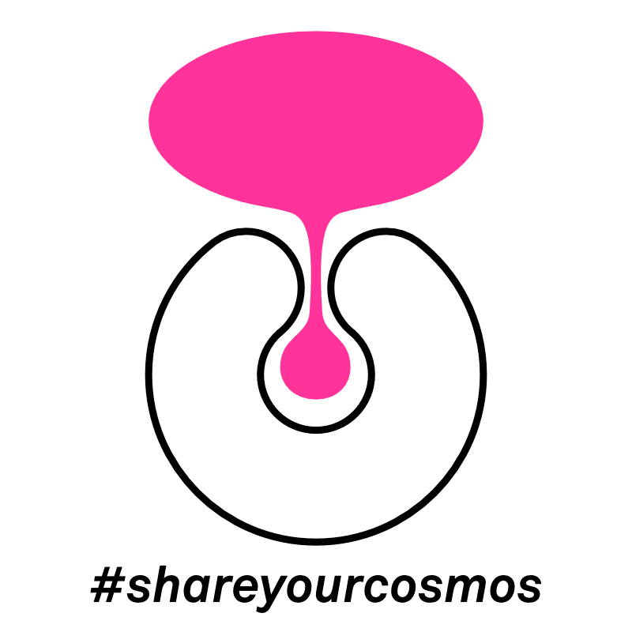
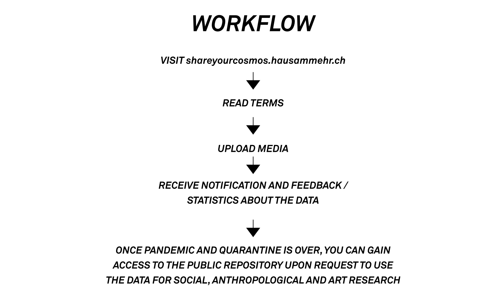
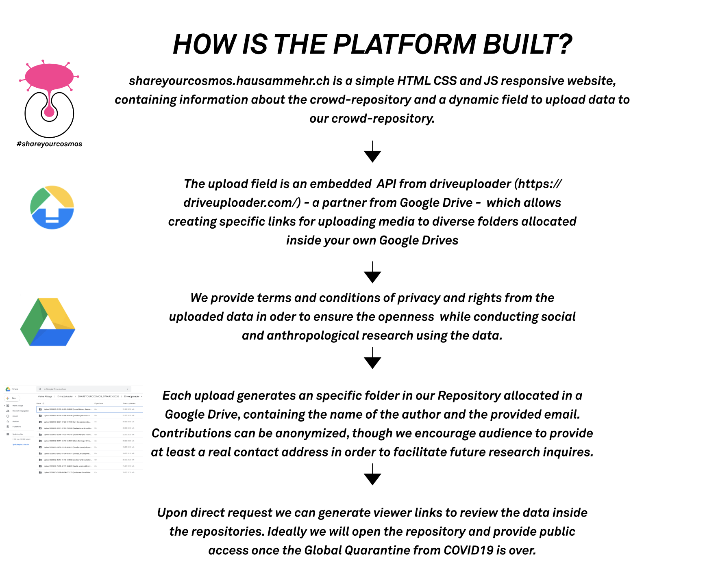
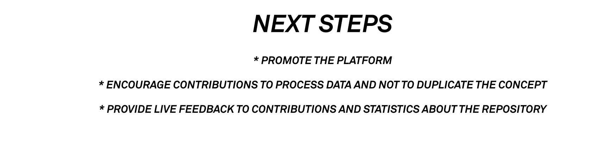
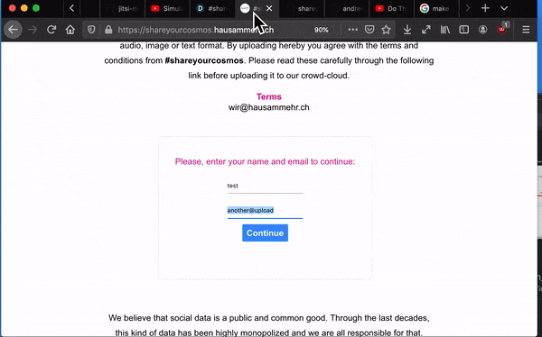

# #shareyourcosmos

TOWARDS SOCIAL OPEN DATA

COVID-19 has affected us all, COVID-19 will change the lives of all of us. The creative collective HAUSAMMEHR would like to document these historical times together with you. Share your impressions, your fears, worries, but also joys. Share your thoughts, feelings and ideas. Share your newly created "micro" cosmos. Whether through video, audio, text, drawings or photography, #shareyourcosmos. HAUSAMMEHR has set itself the task of producing a socially relevant documentary film and an unprecedented art installation that could hardly be more real. The aim is to artistically process authentic recordings, to preserve and to strengthen the awareness of this historical moment for all future generations. Let us share this time together, even if we are spatially apart. Let the future know how we have felt and lived. Let us make art and history together! #shareyourcosmos

You can contribute by uploading any kind of content from your everyday life in video, audio, image or text format. By uploading hereby you agree with the terms and conditions from #shareyourcosmos. Please read these carefully through the following link before uploading it to our crowd-cloud.

We believe that social data is a public and common good. Through the last decades, this kind of data has been highly monopolized and we are all responsible for that. #shareyourcosmos is a crowd-repository maintained by HAUSAMMEHR which has the intention to document our everyday lives during this historical period and to keep it accessible to everyone for (social, anthropological, historical...) research and art practices. If you wish to get free access to the repository, to see how others go through these days and to start your research or art project with this data, please contact Andrés (andresvillatorres@gmail.com) or Chris (chris@masslersantiago.com).

# terms and conditions ( translate to your language and replace )
English: I agree to a publication of the recordings I have submitted as part of #shareyourcosmos.
Furthermore I declare:
I have participated in the production as one of the numerous performers and confirm that the content and purpose of the production have been explained to me.
I allow HAUSAMMEHR the unrestricted use and publication of the recordings for all media. I transfer to HAUSAMMER all copyrights and performer's rights created by me in the course of my work as a performer without any restrictions in terms of content, time and country, as well as the exclusive use of non-transferable rights for any use of an artistic nature. The resale of the pictures is not permitted.
As this is a no-budget production, I waive a fee in any form and make no claims whatsoever. Contributions to AHV/IV/EO/AL are also waived.
HAUSAMMEHR assures that the use of the pictures is not used for purposes of illegal or criminal acts or in a reputation-damaging way.

